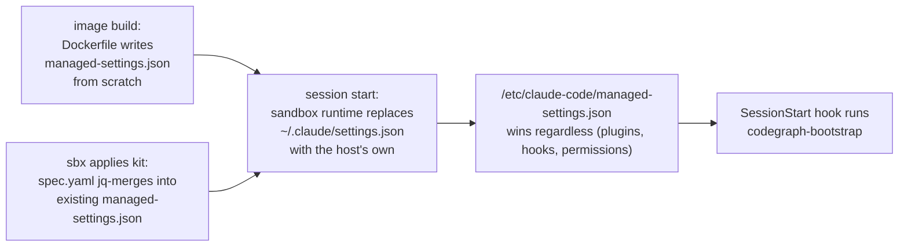

# Architecture

The macro technical shape: the stack, how the pieces fit, and the decisions behind them. Point to the code, do not restate it.

## Stack

- Docker (`Dockerfile`, `docker buildx`, multi-arch `linux/amd64,linux/arm64`) — the templates are built as container images.
- Docker Sandboxes `spec.yaml` grammar, `schemaVersion: "2"` — needs Docker Sandboxes 0.36+ (check with `sbx version`); an older `sbx` rejects `permissions`, `setup`, and `agentInstructions`. Kits describe setup, permissions, and env declaratively, applied by the `sbx` CLI rather than baked into an image.
- GitHub Actions — CI/CD, see `deployment.md`.

## How it fits together

Settings precedence is the load-bearing mechanic, not the directory layout (see `codebase-map.md` for that):

## Key decisions

- The AIDD plugin set is installed by two independent paths that must be kept in sync by hand: `kits/aidd/spec.yaml` (mixin, applied by `sbx`) and `templates/aidd/Dockerfile` (baked into the image). The kit's own comment says it is "installed here to match the `aidd` template."
- AIDD plugins are installed as the `agent` user, never `root`, in both paths: `claude plugin install` writes to `$HOME/.claude`, and a root step's `HOME` is `/root`, which the runtime never sees.
- Plugin enablement is written to `/etc/claude-code/managed-settings.json`, not the user's `~/.claude/settings.json`: the sandbox runtime replaces the user settings file with the host's own at session start, which would otherwise silently disable every installed plugin.
  - `kits/aidd/spec.yaml` `jq`-merges its `extraKnownMarketplaces`/`enabledPlugins` into whatever managed settings already exist, since that file may be shared with other kits.
  - `templates/aidd/Dockerfile` instead writes managed settings from scratch at build time (nothing to merge into yet), and additionally strips `hooks`/`permissions` from the user settings file so the `SessionStart` hook it registers does not fire twice.
- CodeGraph is installed `--location=global` in `templates/aidd/Dockerfile`, not `local`: a local install binds to the build-time working directory, but the real project is mounted at an unknowable path only known at container start.
- `codegraph init`/`sync` cannot run at build time (no project mounted yet), so it runs from the `SessionStart` hook (`codegraph-bootstrap`) instead, backgrounded so the session isn't blocked on indexing.

## Gotchas

- `mcpServers` is not honored from managed settings — CodeGraph's MCP registration stays in `~/.claude.json`, written by `codegraph install`, outside the managed-settings escape hatch above. If CodeGraph's tools are missing from a session, check with `claude mcp list`.
